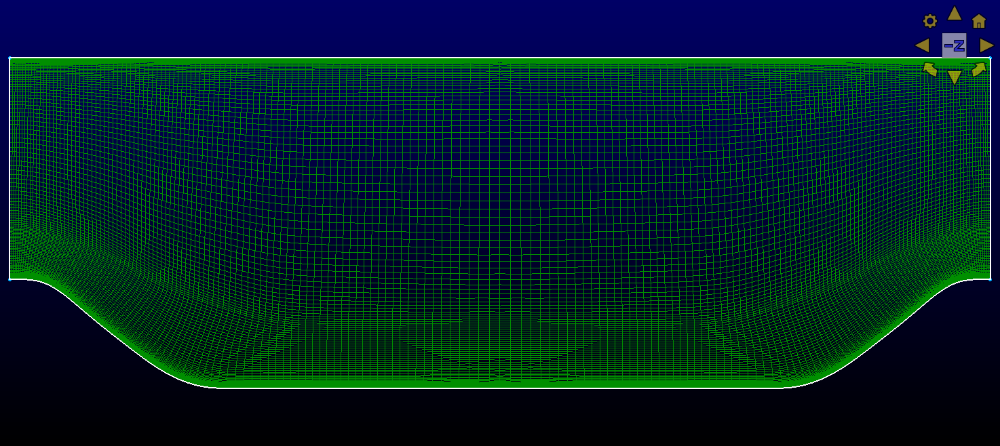

# Periodic hill with `sst`

## Steps
1.  Generate the `periodicHill.exo` mesh
```bash
$ pointwise -b periodicHill.glf
```

This should create a 900k element mesh similar to  


2.  Run the `periodicHill_sst.yaml` test case

After running it completes velocity field should look like


3.  Postprocess
	_Add some stuff in here later_
