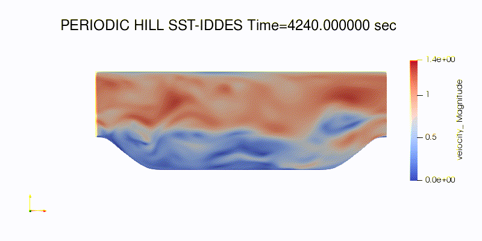

# Periodic hill with `sst`

## Steps
1.  Generate the `periodicHill.exo` mesh
```bash
$ pointwise -b periodicHill.glf
```

This should create a 900k element mesh similar to  


2.  Run the `periodicHill_sst.yaml` RANS test case to get the initial condition

3.  Run the `periodicHill_sstiddes.yaml` SST-IDDES test case to get 

The flow should look like:


4.  Postprocess  

- Use the [`snapshot.py`](../utilities/snapshot.py) to generate snapshots
```bash
$ pvbatch snapshot.py results_sstiddes/periodicHill.e --times 4240 4240.4 4240.8 4241.2 --outfile viz/snapshot
```
- Run the postprocessing utilities
```bash
epu -processor_count 384 sst_iddes_01/results_sstiddes/periodicHill
python pp.py -m sst_iddes_01/results_sstiddes/periodicHill.e
python pp_inlet.py -m sst_iddes_01/results_sstiddes/periodicHill.e
```

- Look at the results in [plots.ipynb](plots.ipynb).
