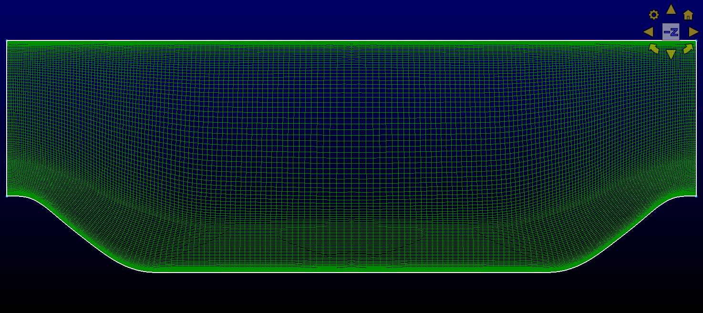

# Periodic hill with `sst`

Same as [sst_iddes_01](../sst_iddes_01) except with higher forcing:
`f=0.012`, instead of `f=0.011`.

## Steps
1.  Generate the `periodicHill.exo` mesh
```bash
$ pointwise -b periodicHill.glf
```

This should create a 900k element mesh similar to  


2.  Run the `periodicHill_sst.yaml` RANS test case to get the initial condition

3.  Run the `periodicHill_sstiddes.yaml` SST-IDDES test case to get 

The wall shear stress should look like


4.  Postprocess  

- Look at the results in [plots.ipynb](plots.ipynb).
